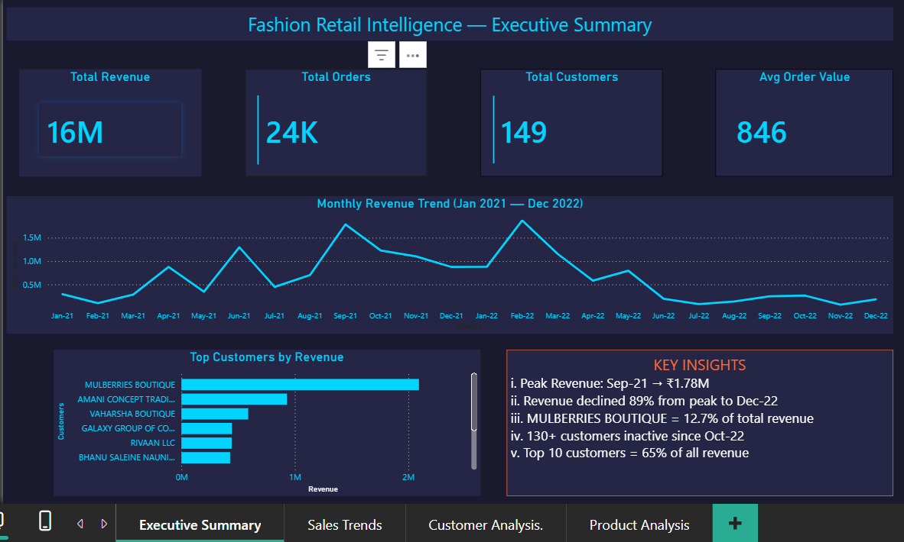

# Fashion Retail Intelligence — Why Is This Business Failing?

[](https://www.python.org/)
[](https://www.mysql.com/)
[](https://powerbi.microsoft.com/)

---

## 📌 Project Overview

A clothing company's revenue dropped **89% in less than a year**. This project investigates what went wrong by analysing 2 years of sales data (Jan 2021 – Dec 2022) using the full Data Analyst workflow: **Python → SQL → Power BI**.

> **Key Finding:** The business lost its top customer (12.7% of total revenue) and 92% of all customers became inactive — revealing a critical customer retention failure.

---

## 🔍 Business Questions

1. What is the overall revenue trend — is the business growing or declining?
2. Who are the most valuable customers and what happened to them?
3. Which products and sizes drive the most revenue?
4. Why did revenue collapse after early 2022?
5. What actionable recommendations can be made?

---

## 📊 Dashboard Preview

### Executive Summary


### Sales Trends


### Customer Analysis


### Product Analysis


---

## 🎥 Video Walkthrough

I present this project as a **business case** — the way a Data Analyst would present findings to stakeholders.

▶️ [Watch the full walkthrough on YouTube](https://youtu.be/Y8TWx8vikOE)

---

## ⚙️ Tools & Workflow

| Stage | Tool | Purpose |
|-------|------|---------|
| 1. Data Cleaning | Python (pandas) | Merged 6 CSV files, handled missing values, fixed data types, created clean dataset |
| 2. Business Analysis | SQL (MySQL) | Wrote 10 queries to uncover revenue trends, customer behaviour, and product performance |
| 3. Visualisation | Power BI | Built 4-page interactive dashboard with business storytelling |

---

## 📈 Key Findings

| Metric | Insight |
|--------|---------|
| Total Revenue | ~$16.4M over 2 years |
| Peak Month | Sep 2021 — $1.78M revenue |
| Revenue Decline | 89% drop from peak to Dec 2022 |
| Top Customer | Mulberries Boutique — $2.09M (12.7% of total) — went inactive May 2022 |
| Customer Retention | 137 of 149 customers (92%) became inactive |
| Best Product | SET268 in Size L |
| Top Sizes | L, M, and XL account for majority of orders |

---

## 💡 Recommendations

1. **Customer Retention Strategy** — With 92% inactive customers, the company urgently needs to investigate why customers are leaving and implement retention initiatives.
2. **Reduce Revenue Concentration** — Depending on one customer for 12.7% of revenue is risky. Diversify the customer base.
3. **Optimise Inventory** — Focus stock on high-demand sizes (L, M, XL) and reduce low-demand sizes (5XL, 6XL, 4XL).
4. **Product Diversification** — Explore expanding beyond SET268 to reduce product dependency.

---

## 📁 Project Structure

```
Fashion-Retail-Intelligence/
│
├── data/
│   └── cleaned_sales_data.csv
│
├── python/
│   └── data_cleaning.py
│
├── sql/
│   └── business_queries.sql
│
├── powerbi/
│   └── fashion_retail_intelligence_dashboards.pbix
│
├── Dashboard Screenshots/
│   ├── Executive Summary.png
│   ├── page2_sales_trends.png
│   ├── page3_customer_analysis.png
│   └── page4_product_analysis.png
│
└── README.md
```

---

## 🧠 What I Learned

- How to **clean and merge multiple datasets** using Python pandas
- Writing **business-focused SQL queries** (GROUP BY, JOINs, window functions like LAG for month-over-month analysis)
- Building **interactive Power BI dashboards** with DAX calculations (custom Month Number column for chronological sorting)
- Designing a **consistent visual theme** (#1A1A2E background, #00D4FF cyan, #FF6B35 orange)
- Most importantly — how to **tell a business story with data**, not just make charts

---

## 📊 Data Source

- **Source:** [Kaggle — Clothing & Apparel Sales Dataset](https://www.kaggle.com/)
- **Records:** 6 CSV files covering Jan 2021 – Dec 2022
- **Fields:** Customer, Date, SKU, Style, Size, Quantity (PCS), Rate, Total Revenue

---

## 👤 About Me

**Rafsan** — Data Analyst based in Melbourne, Australia
- 🎓 Master's in Business Analytics
- 🔗 [LinkedIn](https://www.linkedin.com/in/ahmed-al-rafsan-)
- 📺 [YouTube](https://youtu.be/Y8TWx8vikOE)

*This is part of my Data Analyst portfolio. Each project demonstrates progressively advanced skills — from data cleaning to business storytelling.*

